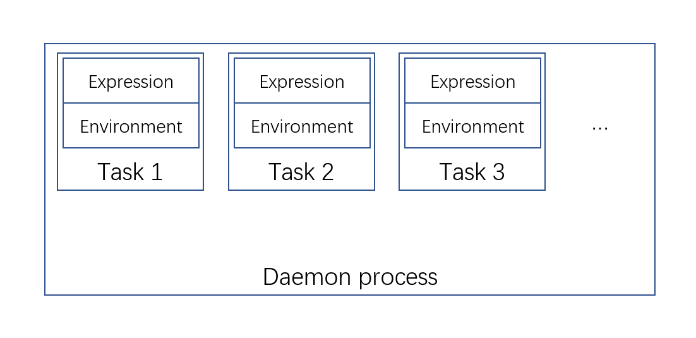

## Introduction
R is a single process language that is designed for interactively used by the user. However, there are some special cases that we might need a daemon process running in the background. Using the other programming languages is an option, but it also require our experience in the other languages. `rdaemon` is a package which is specifically designed for using R as a daemon process. With `rdaemon`, the user can easily start a daemon process using R function. The package is able to run one or many daemon from a single R session, each daemon can be uniquely identified by a daemon name. The daemon will keep running even after the R session quits. Therefore, it is user's responsibility to quit the daemon after using it.

The daemon organizes user's code using the task. A task is combination of the R expression and its running environment and will be run repeatively by the daemon. A daemon can have one or more tasks. The tasks are distinguished by the task ID. Below are the diagram for the daemon


Note that when multiple tasks are in the same daemon, the daemon will run them sequentially. Therefore, it is recommended to make each task relatively simple if many tasks exist in the same daemon. Otherwise a long-running task might block the execution of the other tasks.

Each R process can starts one or more daemons depending on user's needs. Therefore, it is possible to start two daemons from an R process, where the former is responsible for some simple tasks and the latter can do a long-running task.

In this vignette, we will first cover the basic use case, and then talks about the method to optimize the daemon speed.

## Basic usage
### Start a daemon
For starting a new daemon or connecting with an existing daemon, you can simple run

```r
registerDaemon(daemonName = "vignetteDaemon")
```
This will start a daemon named `vignetteDaemon` if the daemon does not exist. Note that if you do not provide the daemon name, a default name will be used which is unique for each R process. In other words, unless you explicitly use the same daemon name, the first call of `registerDaemon()` will always start a new daemon for the current R session by default.


### Set the daemon task
As we stated in the introduction, the daemon organize user's code using the task. The task can be set via `daemonSetTask()`. For example

```r
## Set the task expression and environment for the task with the ID "task1"
## in the daemon named "vignetteDaemon"
daemonSetTask(expr = message(a), 
              exports = list(a = 1),
              taskId = "task1")

## Wait and collect the daemon log to see the output
Sys.sleep(1)
daemonLogs()
#> [1] "INFO [2021-08-30 20:33:45] Daemon PID: 33528"                             
#> [2] "INFO [2021-08-30 20:33:46] A connection from the pid 27940 is established"
```
The package can memorize the last registered daemon. Therefore you do not have to explicitly provide the daemon name after `registerDaemon()`. Likewise, the task ID will also be recorded and used in the subsequent calls after `daemonSetTask()`.

You can also explicitly export some variables to the task after `daemonSetTask()`

```r
daemonExport(b = 2)
```

By default, the task will be run once per second. You can also increase/decrease its frequence by passing the argument `interval` to `daemonSetTask()` or calling `daemonSetTaskInterval()`

```r
## Run the task once per 2 seconds
daemonSetTaskInterval(interval = 2)
```

The task expression can be retrieved by 

```r
daemonGetTask()
#> message(a)
```

There is no function to directly get the task environment, but you can get the variable in the task environment by evaluating an expression in the environment

```r
daemonEval(a)
#> [1] 1
```

### Deregister or kill the daemon
To close the connection to the daemon, simply run

```r
deregisterDaemon()
```
By default, this will remove the task `task1` as well. However, you can left the task running while close the connection by passing `deleteTask = TRUE` to `deregisterDaemon()`

To kill the daemon, run

```r
killDaemon()
```
This will terminate the daemon process.

### Debugging the task
The task expression can be get by `daemonGetTask()` and the daemon log can be obtained by `daemonLogs()`. You can run `daemonEval()` to evaluate an expression under the task environment to see if your code is working in the daemon.


## Optimizing daemon speed
Since the daemon is actually an R process, and R process is relatively heavy , each process can consume about 50MB memory in the system. The overhead might look trivial for a single daemon, but it becomes more serious as the number of daemon increases. For reducing the burden, if the daemon name can be given beforehand, multiple R processes can talk with the same daemon using the same daemon name. For example, we can run the code below in both R session 1 and 2 to connect with the same daemon

```r
registerDaemon(daemonName = "commonName")
```
Therefore, an R session can connect with one or more daemons, a daemon can be connected with one or more R sessions as well. This gives the developer much flexibility to design their daemon structure and reduces the number of daemons required by the program.

## Session info

```r
sessionInfo()
#> R version 4.1.0 RC (2021-05-10 r80296)
#> Platform: x86_64-w64-mingw32/x64 (64-bit)
#> Running under: Windows 10 x64 (build 19043)
#> 
#> Matrix products: default
#> 
#> locale:
#> [1] LC_COLLATE=English_United States.1252 
#> [2] LC_CTYPE=English_United States.1252   
#> [3] LC_MONETARY=English_United States.1252
#> [4] LC_NUMERIC=C                          
#> [5] LC_TIME=English_United States.1252    
#> system code page: 936
#> 
#> attached base packages:
#> [1] stats     graphics  grDevices utils     datasets  methods  
#> [7] base     
#> 
#> other attached packages:
#> [1] readr_1.4.0    rdaemon_0.0.99
#> 
#> loaded via a namespace (and not attached):
#>  [1] Rcpp_1.0.6           knitr_1.33           magrittr_2.0.1      
#>  [4] hms_1.1.0            R6_2.5.0             rlang_0.4.11        
#>  [7] fansi_0.5.0          stringr_1.4.0        tools_4.1.0         
#> [10] xfun_0.23            utf8_1.2.1           lambda.r_1.2.4      
#> [13] futile.logger_1.4.3  htmltools_0.5.1.1    ellipsis_0.3.2      
#> [16] yaml_2.2.1           digest_0.6.27        tibble_3.1.2        
#> [19] lifecycle_1.0.0      crayon_1.4.1         formatR_1.11        
#> [22] base64enc_0.1-3      vctrs_0.3.8          futile.options_1.0.1
#> [25] testthat_3.0.2       evaluate_0.14        rmarkdown_2.8       
#> [28] stringi_1.6.2        compiler_4.1.0       pillar_1.6.1        
#> [31] pkgconfig_2.0.3
```
