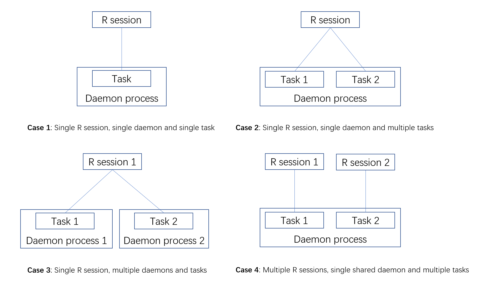

# Introduction
R is a single process language that is designed for interactively used by the user. However, there are some special cases where we might need a daemon process running in the background to silently do some works. However, R does not have a direct support for the daemon process, implementing the daemon requires the experience in both R language and shell scripting, which can be difficult for the non-programmer who just has a limited knowledge of R. 

`rdaemon` is a package which is specifically designed for using R as a daemon process. A daemon process can be easily started and managed by pure R functions using `rdaemon`. The package is able to run one or many daemon from a single R session and each daemon will be uniquely identified by a daemon name. The daemon will keep running even after the R session quits. Therefore, it is user's responsibility to quit the daemon after using it.

The daemon organizes user's code using the task. A task is combination of the R expression and its running environment and will be run repeatedly by the daemon. A daemon can have one or more tasks. The tasks are distinguished by the task ID. Below are the diagram for the daemon


Note that when multiple tasks are in the same daemon, the daemon will run them sequentially. Therefore, it is recommended to keep each task relatively simple if many tasks exist in the same daemon. Otherwise a long-running task might block the execution of the other tasks.

`rdaemon` supports many daemon structure, below are the common use cases.



In this vignette, we will first cover the basic use case, and then talks about some advanced topics. Here is a list of terminology we will use through this vignette

1. Daemon: A non-interactive R process running in the backgroud
2. R session: An R process which can be used by the user to control the daemon. It is mostly an interactive foreground process, but can also be non-interactive.
3. Task: A combination of the R expression and environment evaluated by the daemon regularly.


# Basic usage
## Start a daemon
For starting a new daemon or connecting with an existing daemon, you can simple run

```r
registerDaemon(daemonName = "vignetteDaemon")
```
This will start a daemon named `"vignetteDaemon"` if the daemon does not exist. Note that if you do not provide the daemon name, a default name will be used which is unique for each R process. In other words, unless you explicitly use the same daemon name, the first call of `registerDaemon()` will always start a new daemon for the current R session by default.


## Set the daemon task
As we stated in the introduction, the daemon organize user's code using the task. The task can be set via `daemonSetTask()`. For example

```r
## Set the task expression and environment for the task with the ID "task1"
## in the daemon named "vignetteDaemon"
daemonSetTask(expr = message("The variable a is ", a), 
              exports = list(a = 1),
              taskId = "task1")

## Wait and collect the daemon logs to see the output
Sys.sleep(2)
tail(daemonLogs(), n = 1)
#> [1] "The variable a is 1"
```
Where `expr` is an R expression that will be set to the task, `exports` is a list of object that will be exported to the task environment and must be named. `taskId` determines the ID of the task which will be affected by this function call.

You might notice that we did not provide the daemon name in the above code snippet, this is because that the package can memorize the last registered daemon in `registerDaemon()` call. Therefore, unless you want to use a different daemon name, You do not have to explicitly provide the daemon name after calling `registerDaemon()`. Likewise, the task ID will also be recorded and used as the default task ID in the subsequent function calls after `daemonSetTask()`.

You can also set the task expression via an R script. For example

```r
## Generate a temp script
script <- tempfile()
cat("message('Hello from the script')", file = script)

## Set the task expression for the task with the ID "task1"
## We do not have to provide the task ID as 
## it has been memorized by the package
daemonSetTaskScript(script)

## Wait and collect the daemon log to see the output
Sys.sleep(2)
tail(daemonLogs(), n = 1)
#> [1] "Hello from the script"
```
`daemonSetTaskScript()` will ultimately use `daemonSetTask()` to set the task expression, so if you use a different task ID in `daemonSetTaskScript()`, it will also affect the default task ID for the subsequent function call.

You can explicitly export some variables to the task using `daemonExport()`

```r
daemonExport(b = 2)
```

By default, the task will be run once per second. You can also increase/decrease its frequency by passing the argument `interval` to `daemonSetTask()` or calling `daemonSetTaskInterval()`

```r
## Run the task once per 2 seconds
daemonSetTaskInterval(interval = 2)
```

The task expression can be retrieved by 

```r
daemonGetTask()
#> expression(message('Hello from the script'))
```

There is no function to directly get the task environment, but you can get the variable in the task environment by evaluating an expression in the task environment using `daemonEval()`

```r
## List variables in the task environment
daemonEval(ls())
#> [1] "a" "b"

## Get the variable `a`
daemonEval(a)
#> [1] 1
```

## Deregister or kill the daemon
To close the connection to the daemon, simply run

```r
deregisterDaemon()
```
By default, this will remove the task `task1` as well. However, you can left the task running while close the connection by passing `deleteTask = TRUE` to `deregisterDaemon()`

To kill the daemon, run

```r
killDaemon()
```
This will terminate the daemon process.

# Advanced topics
## Debugging the task
The task expression can be get by `daemonGetTask()` and the daemon log can be obtained by `daemonLogs()`. You can run `daemonEval()` to evaluate an expression under the task environment to see if your code is working in the daemon.


## One-time connection
Sometimes we might only want to query the daemon status once and do not need to register the daemon as our default daemon. This can be easily done by explicitly providing the daemon name in the daemon function. For example, if a daemon named `"monitorDaemon"` is running in the background, you can ask it to send its logs without registering the daemon

```r
daemonLogs(daemonName = "monitorDaemon")
```
You need to check whether the daemon is running before using the one-time connection if you want to use this feature in non-interactive R sessions. An error will be thrown if the daemon does not exist. 

# Utility functions
Besides the daemon functions, the package also provides a few utility functions to help manage the process. 

`interruptProcess()` is used to send SIGINT signal to the other process given the pid of the process. Even though this function can be called from any R session, it is recommended to only use it inside the daemon task.

`isProcessAlive()` can be used to check whether a process is running or not. This function does not have the restriction like `interruptProcess()` and can be called from user's R session.


## Session info

```r
sessionInfo()
#> R version 4.1.0 RC (2021-05-10 r80296)
#> Platform: x86_64-w64-mingw32/x64 (64-bit)
#> Running under: Windows 10 x64 (build 19043)
#> 
#> Matrix products: default
#> 
#> locale:
#> [1] LC_COLLATE=English_United States.1252 
#> [2] LC_CTYPE=English_United States.1252   
#> [3] LC_MONETARY=English_United States.1252
#> [4] LC_NUMERIC=C                          
#> [5] LC_TIME=English_United States.1252    
#> system code page: 936
#> 
#> attached base packages:
#> [1] stats     graphics  grDevices utils     datasets  methods  
#> [7] base     
#> 
#> other attached packages:
#> [1] readr_1.4.0    rdaemon_0.0.99 testthat_3.0.2
#> 
#> loaded via a namespace (and not attached):
#>  [1] Rcpp_1.0.6           compiler_4.1.0       pillar_1.6.1        
#>  [4] formatR_1.11         futile.logger_1.4.3  prettyunits_1.1.1   
#>  [7] futile.options_1.0.1 base64enc_0.1-3      remotes_2.4.0       
#> [10] tools_4.1.0          digest_0.6.27        pkgbuild_1.2.0      
#> [13] pkgload_1.2.1        evaluate_0.14        memoise_2.0.0       
#> [16] lifecycle_1.0.0      tibble_3.1.2         pkgconfig_2.0.3     
#> [19] rlang_0.4.11         cli_2.5.0            rstudioapi_0.13     
#> [22] diffobj_0.3.4        yaml_2.2.1           xfun_0.23           
#> [25] fastmap_1.1.0        stringr_1.4.0        knitr_1.33          
#> [28] withr_2.4.2          hms_1.1.0            desc_1.3.0          
#> [31] fs_1.5.0             vctrs_0.3.8          devtools_2.4.1      
#> [34] rprojroot_2.0.2      glue_1.4.2           R6_2.5.0            
#> [37] processx_3.5.2       fansi_0.5.0          rmarkdown_2.8       
#> [40] waldo_0.2.5          sessioninfo_1.1.1    rematch2_2.1.2      
#> [43] callr_3.7.0          purrr_0.3.4          lambda.r_1.2.4      
#> [46] magrittr_2.0.1       htmltools_0.5.1.1    ps_1.6.0            
#> [49] ellipsis_0.3.2       usethis_2.0.1        utf8_1.2.1          
#> [52] stringi_1.6.2        cachem_1.0.5         crayon_1.4.1
```
